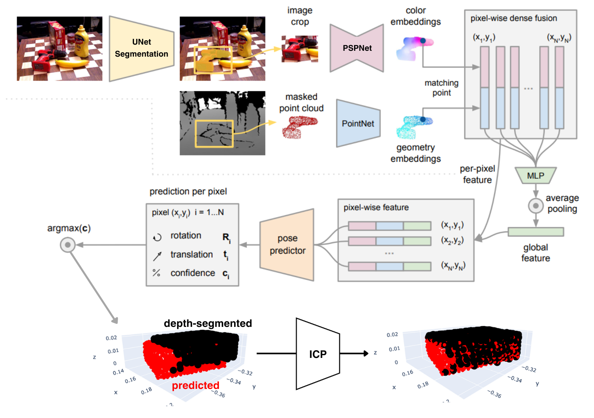
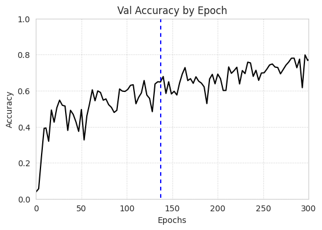
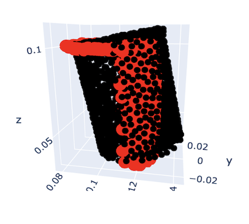
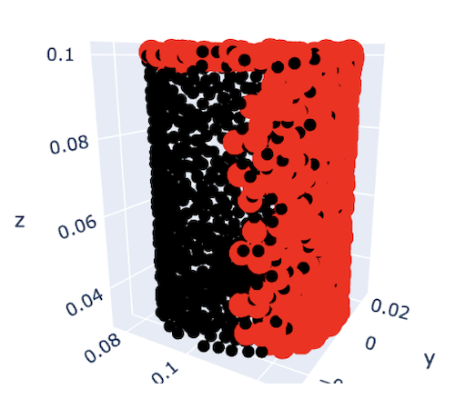
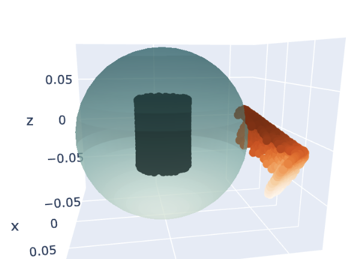
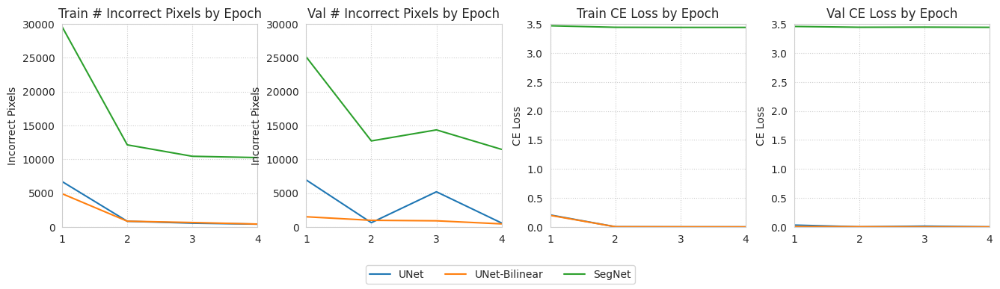
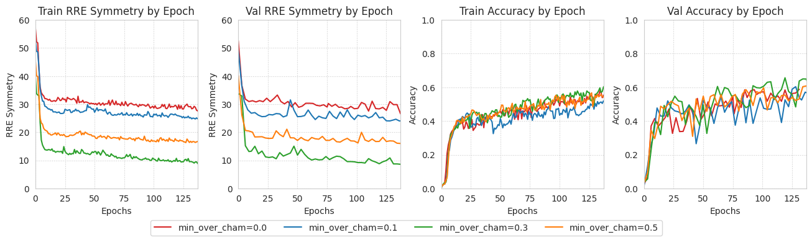
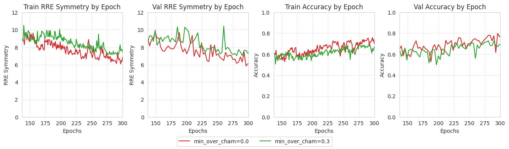
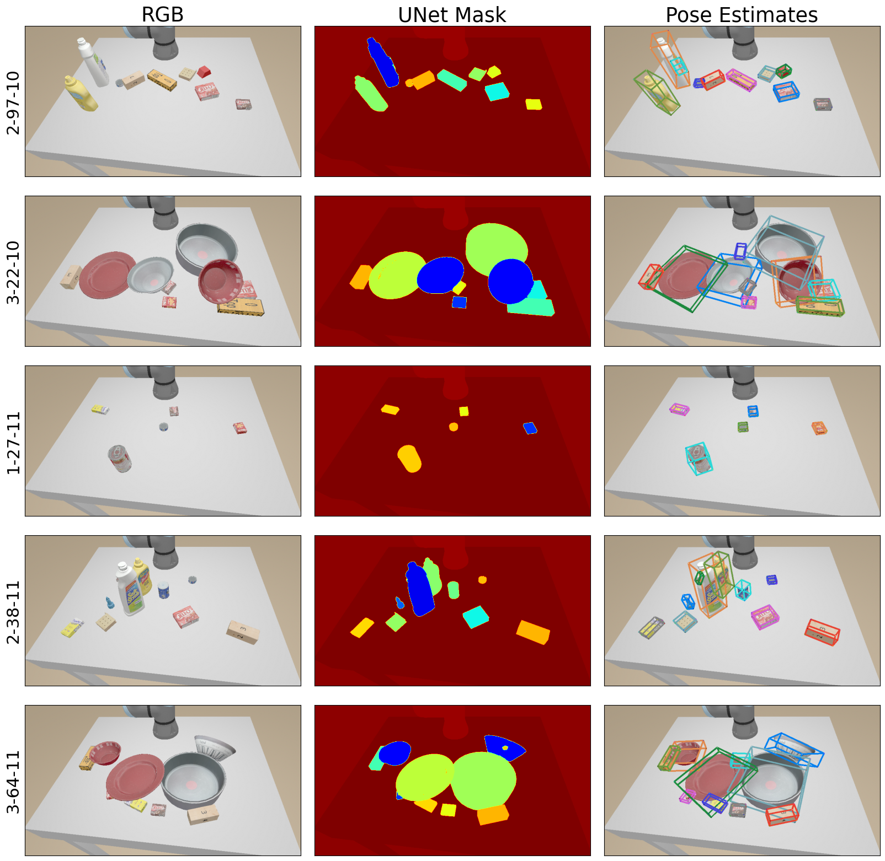

# DenseFusion (w/ Altered Loss) + ICP Refinement for 6D Pose Estimation

This is a DenseFusion + ICP refinement implementation which won me **1st place** in a DL 6D Pose Estimation competition for _CSE 275: Deep Learning for 3D Data_ (a graduate-level course at UCSD which I took in my third year of undergrad, fall quarter).

The class assignment contained a leaderboard for solutions over three categories: algorithmic method, learning method, and learning + refinement method. The final benchmark was on levels 1-3 of the YCB Object Dataset [[3]](#3) recreated in ManiSkill2 [[1]](#1).

The solutions provided in this repo achieved the **top solutions per category**, as well as the **top 3 solutions overall**. Specfics on scores (as well as method, visualizations, ablations, etc) are available in the [writeups](#writeups).

## Writeups

For a more detailed explanation of all methods used, please check out some included writeups which were also submitted to the class:

1. [Full report on all three solutions on levels 1-3](./writeups/DF_ICP_1-3.pdf) with explanations and figures for each.
2. [Report of ICP on levels 1-2](./writeups/ICP_1-2.pdf) with some additional visualizations explaining choices made when running ICP.

Note that these writeups mention "HW2" and "HW3." HW2 had a test set of 200 scene arrangements across levels 1-2 of the YCB Object Dataset, while HW3 had a test set of 600 scene arrangements across levels 1-3.

## Technologies Used

Architectures/Algorithms/Concepts: DenseFusion, ICP, 6D Pose Estimation, PointNet, Shape- and Symmetry-Aware Losses

AI Development: Pytorch (Torch, Cuda, Datasets, DataLoaders, DataParallel), WandB

## Method Overview

### UNet Semantic Segmentation

We use a UNet for semantic segmentation on the RGB images. In this dataset, there are at most one instance of each object in a particular scene arragnement, so semantic segmentation is sufficient, and instance segmentation is not necessary. We use the segementation mask to get a depth-lifted point cloud (using camera intrinsic and extrinsic) and to crop the RGB image.

### DenseFusion (+ ICP Refinement) Architecture

DenseFusion was the learning method and DenseFusion + ICP Refinement was the learning + refinement method. Please note that the PSPNet implementation is from [https://github.com/Lextal/pspnet-pytorch](https://github.com/Lextal/pspnet-pytorch).

The network architecture + refinement procedure is pictured below:

<figure>
  

    
  

  <figcaption>Full UNet + DenseFusion + ICP Refinement architecture. The top part of the image is altered from the original DenseFusion paper <a href="#2">[2]</a>. Note that the pre-refinement prediction shown in the figure was manually altered to make the difference more visibly noticeable. In reality, the difference is smaller, though refinement still results in improvements.</figcaption>
</figure>

### Altered DenseFusion Loss

Unlike the original DenseFusion paper [[2]](#2) which only uses Chamfer and per-point MSE, I use **3 different losses**:

1. Chamfer distance for objects with infinite order symmetries
2. min-of-n loss for objects with finite order symmetries
3. simple per-point MSE for object with no symmetries

Furthermore, since Chamfer distance is known to get stuck in suboptimal local minima, I introduce a hyperparameter `min_over_cham` between 0 and 1 which represents the probability that min-of-n loss will be used over Chamfer distance for objects with infinite order symmetries.

### Adding DenseFusion Two-Stage Training

We train in two stages. During the first stage, `min_over_cham=0.3`, and during the second stage, `min_over_cham=0`. The first stage is meant to help avoid suboptimal local minima to reduce relative rotation error (RRE), while the second stage is to further refine results from stage 1. The values for `min_over_cham` are chosen based on [ablation results](#ablations).

<figure>
  

    
  

  <figcaption>Validation accuracy with <code>min_over_cham=0.3</code> during Stage 1 and <code>min_over_cham=0</code> during Stage 2. The blue line indicates switching from Stage 1 to Stage 2. After 300 epochs, we reach 80% validation accuracy <i>without</i> ICP refinement.</figcaption>
</figure>

### Standalone ICP

We also run standalone ICP for the algorithmic method. In particular, because the depth-lifted point cloud suffers from heavy occlusions (as the camera can only see part of the object), using the depth cloud as source and model cloud as target fails. Thus, we use the model cloud as the target and the depth cloud as the source. Then, we invert the transformation to get the final pose estimation.

<table>
  <tr>
    <td>
      <figure>
        
        <figcaption>An example of failure when using model as source and depth cloud as target. ICP minimizes distances of all points on source cloud to target cloud. So, we end up with this odd result.</figcaption>
      </figure>
    </td>
    <td>
      <figure>
        
        <figcaption>Correct result from using depth cloud as source and model as target. ICP finds the minimal distance between depth cloud points and model points by placing depth cloud on model cloud.</figcaption>
      </figure>
    </td>
  </tr>
</table>

We also run multiple attempts by initializing the depth-lifted cloud on a ball around the model point cloud and applying a random rotation before running ICP.
<figure>
  

    
  

  <figcaption>An example of our random initialization strategy. We have a ball centered at the model’s center with 2 times model radius. We move our depth cloud to somewhere on the ball, then apply a random rotation before running ICP.</figcaption>
</figure>

## Ablations

We run three sets of ablations:

1. **Semantic Segmentation Model**: UNet Transpose Convolution, UNet Bilinear Interpolation, Vanilla SegNet. We do this to show that the Vanilla Segnet from the original DenseFusion paper [[2]](#2) can be improved.
2. **Stage 1 `min_over_cham`**: Values of 0, 0.1, 0.3, and 0.5. Stops when first curve hits 60% train accuracy. We do this to show that nonzero `min_over_cham` indeed does reduce RRE Symmetry, meaning the model better avoids suboptimal local minima.
3. **Stage 2 `min_over_cham`**: Values of 0 and 0.3. Resumes from Stage 1 of `min_over_cham=0.3`, since that model performed the best. We do this to show that maintaining a nonzero `min_over_cham` throughout will result in a model that cannot finetune as well; hence, a second stage is necessary.

Ablation curves are pictured below:

  <figure>
    

      
    

    <figcaption>Ablations for Semantic Segmentation Networks: UNet, UNet Bilinear, SegNet. Note that each image is 1280x720, totaling 921,600 pixels.</figcaption>
  </figure>

  <figure>
    

      
    

    <figcaption>Ablations for DenseFusion Stage 1 training. Training stops at epoch 137, when the <code>min_over_cham=0.3</code> model achieves >60% train accuracy.</figcaption>
  </figure>

  <figure>
    

      
    

    <figcaption>Ablations for DenseFusion Stage 2 training. Both training curves resume from epoch 137 of the <code>min_over_cham=0.3</code> Stage 1 curve.</figcaption>
  </figure>

## Visualizations

Below we provide some visualizations for the results of this model. Results on the CSE 275 benchmarks are available and additional discussion is available in the [writeups](#writeups).

<figure>
  

    
  

  <figcaption>Visualizations of RGB input, UNet segmentation, and Pose Estimation results from DenseFusion + ICP Refinement.</figcaption>
</figure>

## References
<a id="1" href="https://arxiv.org/abs/2302.04659" target="_blank">[1]</a> 
Jiayuan Gu, Fanbo Xiang, Xuanlin Li, Zhan Ling, Xiqiang Liu, Tongzhou Mu, Yihe Tang, Stone Tao, Xinyue Wei, Yunchao Yao, Xiaodi Yuan, Pengwei Xie, Zhiao Huang, Rui Chen, and Hao Su. Maniskill2: A unified benchmark for generalizable manipulation skills, 2023

<a id="2" href="https://arxiv.org/abs/1901.04780" target="_blank">[2]</a> 
Chen Wang, Danfei Xu, Yuke Zhu, Roberto Mart&iacute;n-Mart&iacute;n, Cewu Lu, Li Fei-Fei, and Silvio Savarese. Densefusion: 6d object pose estimation by iterative dense fusion, 2019.

<a id="3" href="https://arxiv.org/abs/1711.00199" target="_blank">[3]</a>
Yu Xiang, Tanner Schmidt, Venkatraman Narayanan, and Dieter Fox. Posecnn: A convolutional neural network for 6d object pose estimation in cluttered scenes, 2018.

## About Me

Arth Shukla [Site](https://arth.website) | [GitHub](https://github.com/arth-shukla) | [LinkedIn](https://www.linkedin.com/in/arth-shukla/)
